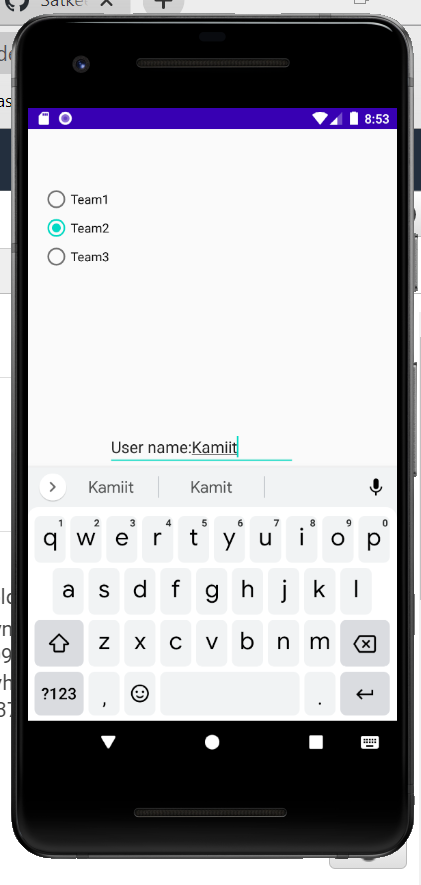
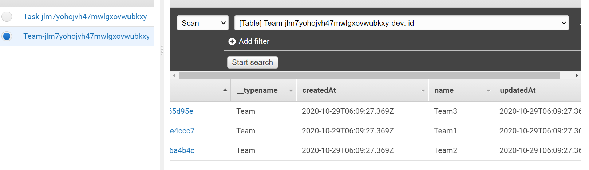

#### SOCCER app.

-Click to <Settings> and enter your User name 
-Then click <Update Username>
-Click to <Add task> 
-User can fill out fields <My Task>, <do something> and <Status Task> for tracking tasks
-Click to <Add Task> go to back to <Soccer> home page.
-Click to <All tasks> and User can see three tasks
-Click to buttons <Soccer stadiums>, <Soccer tickets>, <Soccer schedule> where User can see all these information

http://github/Satkeev

Testing by Espresso
<Run> -> <Record Espresso Test> start for UI app testing
<Add Assertion> for choise what you testing
Choise on emulator button or text or other for testing
<Save Assertion> 
Create a test file
Run test file and check test results
An Android app for tracking tasks!

Changelog  
10/19/20  
initialized project  
main tasks page added  
add task page added  
task list page added  
10/20/20  
created task details page  
created settings page  
added task buttons with intents to task details  
task list title dynamic to username in settings  
10/21/20 - task class created - set up recycler view for task list - made task list   clickable to view details  
10/22/20  
added Room dependencies and linked Task as an Entity  
edited task list to refer to database  
replaced hard coded task inserts with reference to add form  
adding tests for task and username changes  
10/26/20  
adding tests for task views and main user paths    
updated screenshots  
10/27/20  
connected to DynamoDB using Amplify  
converted task add to save to DynamoDB instead of Room  
main page task list now updated from DynamoDB  
10/28/20    
added subscription and handler to keep task list up to date with cloud  
created state and team models with relations to the task model  
replaced submitted popup with toast on add task form  
added hard coded radio button team selection to add task form  
updated task save to match relations on DynamoDB  
removed connection to local Room storage  
task list now displays tasks of user's team  
11/02/20  
added Cognito user authentication plugin  
created activities for signup, user confirmation, and login  
linked new activites to user authentication operations  
added logout button  
adjusted main page to display signed in username  
11/03/20  
added AWS S3 files for use S3 storage, and upload, retrieve files with  
images  
11/04/20  
linked to Firebase for push notificationsnn
attached Pinpoint push notifications through Firebase  
11/05/20  
added Amplify Analytics plugin  
created event tracking App Start  
added event tracking user button clicks  
linked Pinpoint stream to Kinesis  
11/09/20  
made image shares receivable to add task form
shared images can now be saved with new task and viewed with task details  
11/10/20   
made location on main page and save address  

